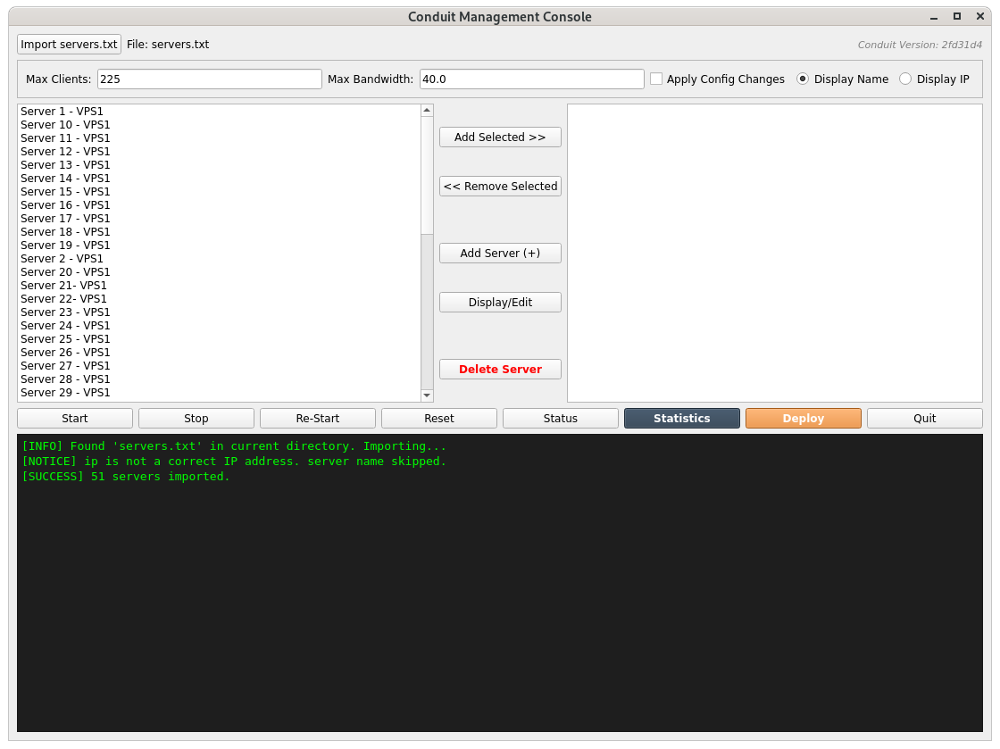
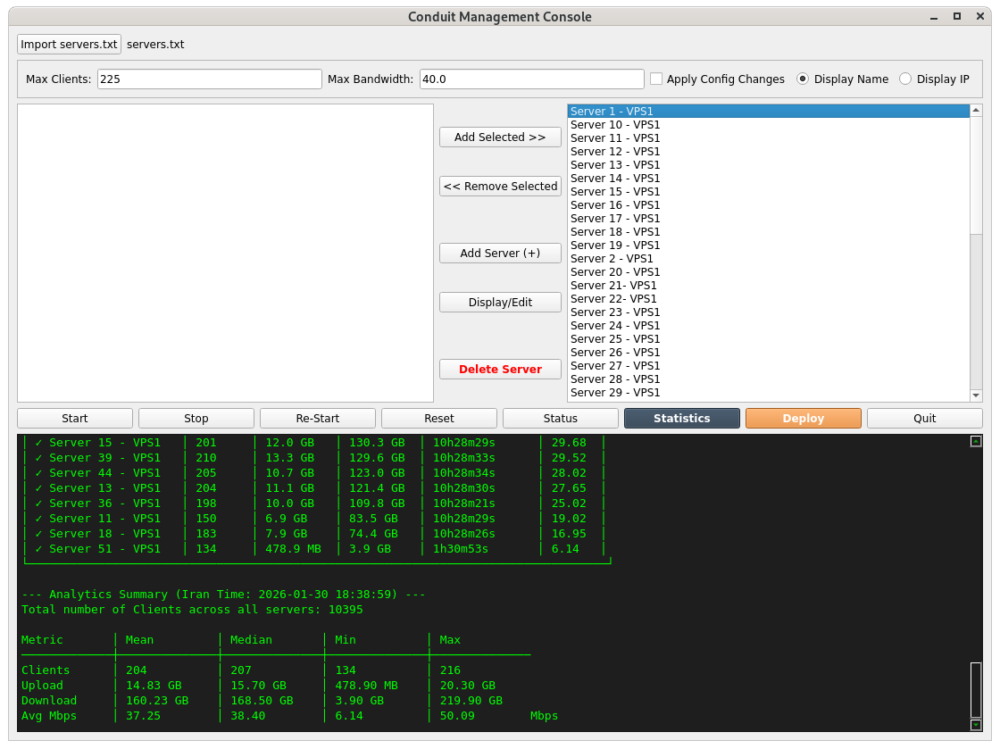

# Psiphon Conduit: Cross-Platform Remote Management
## Deploy, monitor, and manage Psiphon Conduit across Windows, Linux, and macOS.
This repository features an interactive application designed to streamline the deployment and real-time monitoring of Psiphon Conduit on remote Linux servers. Effortlessly manage everything from a single instance to hundreds of servers with minimal overhead.

# 🛡️ Conduit Manager
**Download:** 🚀 Get Started: Click the button below to download the latest version as a ZIP file, or clone the repository directly.

[ -2ea44f?style=for-the-badge&logo=github&logoColor=white) ](https://github.com/Starling226/conduit-manager/archive/refs/heads/main.zip)


## Download and Preparations
1. **Python Instalation:** Please visist https://www.python.org/downloads/ and install the latest python

2. **Create Directory:** Create a folder named `Conduit` in your `C:\` partition in Windows or /opt/conduit in Linux and macOS environments.
3. **Download Scripts:** Save the following scripts into `C:\Conduit` or /opt/conduit:
   * `setup_conduit.bat`
   * `setup_conduit.sh`
   * `ConduiQt.py`
   
## SSH Genetaion and Python Installation
**Setup:** From the Conduit folder double click on `setup_conduit.bat` for Windows or run `setup_conduit.sh` in terminal. This will generate ssh keys in .ssh folder in user home folder and install the required python packages.

---

## Conduit Deployment
## 🖥️ Interactive GUI: Conduit Manager

The `ConduitQt.py` application is a robust, multi-threaded, cross-platform management suite built with **PyQt5**. It provides a unified interface for deploying, managing, and monitoring Conduit servers across **Windows, Linux, and macOS** environments.

### 🚀 Key Features

* **Dynamic Server Management**: Easily manage your infrastructure via the `servers.txt` configuration file. Add, edit, or remove servers, and the GUI reflects changes instantly.
* **Batch Operations**: The interface uses a "Targeting" system. Simply move servers to the **Right List (Target List)** to include them in an action.
    > **Note:** Every server in the Right List will be included in the requested operation (Deploy, Start, Stop, or Reset), regardless of whether it is currently highlighted.
* **Real-time Monitoring**: The multi-threaded architecture ensures the UI remains responsive while performing heavy deployment tasks or fetching live statistics from multiple nodes simultaneously.
* **Graphic Interface for Network Traffic Monitoring**: The graphic interface allows monitoring of servers inividually using the high peformance PyQtgraph library.
* **Configuration Updates**: By enabling the **"Apply Config Changes"** checkbox, you can push new parameters (such as client limits or bandwidth caps) to your servers during a *Start* or *Restart* command.


---

### 🛠️ How to Use

1.  **Import**: Load your `servers.txt` to populate the available server list. Scroll down to **management** section to see how to create servers.txt.
2.  **Target**: Move the desired servers from the left panel to the right-hand (Target) panel.
3.  **Execute**: Choose your operation (e.g., *Deploy*, *Reset*, *Stop*, etc.). If you have deployed your servers click on refresh button to immediatly update your servers status table.
4.  **Monitor**: Follow real-time progress and logs in the integrated console output and graphical interface.

---

### 📂 Component Overview


| Component | Platform | Primary Use Case |
| :--- | :--- | :--- |
| **ConduitQt.py** | Cross-Platform | Full-featured visual management & bulk deployment. |

---

### ⚠️ Important Security Note
During a **Fresh Deployment**, if a root password is provided in `servers.txt`, the application will use it to install your SSH public key (`id_conduit.pub`). Once the deployment is successful and the key is verified, the application will automatically strip the root password from your `servers.txt` file for security.


### Screenshot of the Conduit Manager Qt Application

Here is the GUI interface for Conduit Management:


*(Screenshot showing Conduit management)*


*(Screenshot showing Conduit network traffic feature)*

### Running Python Script
To run ConduitQt.py, simply double click on or run them in the command line terminal using the py command in Windows `py ConduitQt.py`, or python3 in Linux or macOS `python3 ConduitQt.py`.

---

## Management

The Start, Stop, Re-Start, Reset, Status, Upgrade, Deploy allows you to manage your servers efficiently. Sometime even after few hours you have no clients; in that case, you might reset the conduit to get fresh keys and get clients.

### Using servers.txt
For the Management and Monitoring scripts to work with multiple servers, create a `servers.txt` file in the same directory that you run any of the scripts. Upon successfull deployment the ssh public key will be injected to the server and root password will be removed from servers.txt. You must add root server for deployment if you plan to deploy mutiple servers simultaneouly. If you plan to deploy single server through the GUI applcation you will be prompted to enter the root password. Any comunication with the server will be perfomred using the ssh keys after successfull deployment. Default port is 22.

**Format:**
`name,hostname,port,username,password`. Do not add this header to servers.txt.

**Example:**
`MyServer,123.45.67.89,22,root,password`

## Monitoring

After installation, the Psiphon network requires time for vetting and propagation. This can take anywhere from a few minutes to several hours. You can use Statistics, or watch the Status Table for real time monitoring. You can click on Visualize to see the network traffic for individual servers. The graphs are interactive, hold the mouse right button and drag the mouse up and down, left or right to zoom, unzoom. Hold the mouse right button to move up and down, shift to right and left. Right click on graph and click on "View All" to reset and export the save the graph. Using Traffice mode in Visualizer window you can see the total and interval traffic. Displayed Date Time represent the server time zone.

---

## Troubleshooting

| Issue | Potential Cause | Solution |
| :--- | :--- | :--- |
| **Connection Timeout** | Firewall is blocking Port 22. | Ensure Port 22 is open in your VPS cloud firewall. |
| **Authentication Failed** | Incorrect password or root disabled. | Ensure `PermitRootLogin yes` is set in `/etc/ssh/sshd_config`. |
| **Permission Denied** | Not logged in as root. | Non-Status actions (Start/Stop/Reset) require root access. |
| **Architecture Mismatch** | you are using a modern Mac with an M1, M2, or M3 chip (Apple Silicon), and you run into issues installing PyQt5| You might need to install it via Homebrew instead of pip|

   ```bash
   brew install pyqt@5
   ```
## Features Note
* **Add server:** Use Add Server(+) if you have not added any server yet. You can also use this later to add further servers.
* **Delete server:** Use Delete Server if you no longer needed.
* **Deploy:** Select one or a number of servers in the right panel and cick Deploy. This will deploy your server(s)
* **Upgrade:** This upgrade the conduit cli binary in remote server to the version displayed in GUI. It also upgrade to the latest get_stat_conduit.py.
* **Status:** Clicking on this dosplay the current status of your server(s), whether it is active or dead. It also shows the last 10 connections to the server.
* **Statistics:** This shows the network analytic. Clients is the average of last one hour. To get the current live connections and conduit status click on Status Button.
* **Stop:** If you like to stop Conduit service, use this. You hardly need this.
* **Start:** If Conduit service is not active, use this to start it.
* **Re-Start:** If you want to chnage Conduit parameters, like Max Clients or Bandwidth, check Apply Config Changes Checkbox and click Re-start. You can also use this if yours server is not connect after couple of hours.
* **Reset:** You can reset the Conduit config using this. In case if you have not received any client or you think you do not have more clients usually less than 50 for more than a day, you can reset the config. If after frew hours you have receieved any clients you can also reset the config.
* **Display Name/IP:** Use this to siwtch the list to Server name or IP address.
* **Max Clients:** As a rule of thumb, each core should support 50-60 clients. So if you have 4 cores you can set it to 225. This will possibly gives you up to 200 clients.
* **Status Table:** If the selection panel is empty you can highlight IP addresses in Status Table and directly do oprtaions. Click column header to sort ascending or descending.
* **Traffic:** Traffic allows you to monitor network traffic across the individual servers. When you click on Traffic, it imports the server log files from local disk. Within the Visualizer window you can click on "Reload to retrieve the data" and it starts fetching the latest conduit logs from the servers. Please be patient, it may takes a couple of minutes to download the logs.
* **Report:** Report allows you to download and display conduit hourly network traffic across the individual servers. When you click on Traffic, it imports the server hourly log files from local disk. Within the Visualizer window you can click on "Reload to retrieve the data" and it starts fetching the latest hourly logs from the servers. Please be patient, it may takes a couple of minutes to download the logs.

## Important Notes
* **SSH Port:** These scripts use the standard **SSH Port 22** for all connections.
* **Security Warning:** The `servers.txt` file contains plain-text passwords. **DO NOT** upload this file to GitHub.

---

## Credits & Acknowledgments

This deployment suite is designed for use with the **Conduit** binary provided by [ssmirr](https://github.com/ssmirr/conduit).

* **Binary Source:** [ssmirr/conduit](https://github.com/ssmirr/conduit)
* **Upstream Project:** Based on the original [Psiphon Conduit](https://github.com/Psiphon-Labs/psiphon-conduit) by Psiphon Labs.

---

## Disclaimer

**Use this software at your own risk.** These scripts are provided "as is" without any warranty of any kind. 

* **No Liability:** The author(s) assume **no liability** for loss of data, server downtime, or any damages resulting from the use of this code.
* **Third-Party Binaries:** These scripts are designed to download and install the official **Psiphon Conduit binary**. The author of these scripts is **not responsible** for the maintenance, security, or functionality of the Conduit binary itself.
* **Affiliation:** This project is an independent community tool and is **not** officially affiliated with or endorsed by the Psiphon team.


